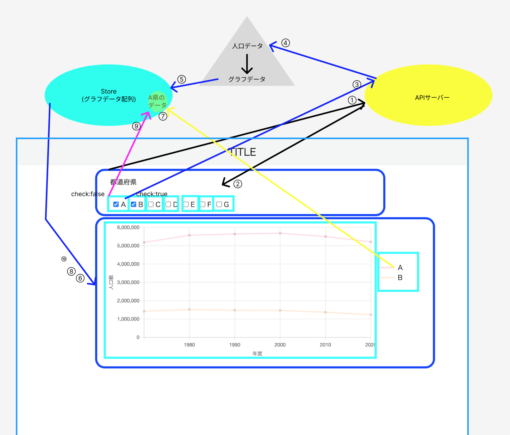

# データフロー

~~ のようなもの ~~

## Webページへのアクセスしてから、各都道府県名とチェックボックスが描画されるまで

1. Webページにアクセスすると、サーバーにリクエストを送り(①)、47都道府県の県名とコードのデータをレスポンスとして取得する(②)
2. サーバーから受け取った47都道府県の県名とチェックボックスを描画する

## A県のチェックボックスにチェックを入れてから、A県の線グラフが描画されるまで

3. A県のチェックボックスにチェックを入れると、サーバーにリクエストを送る(③)
4. A県の年代毎の人口数データを取得する(④)
5. A県の年代毎の人口数データをグラフ描画用のデータに変換し、Store内のグラフ描画データ配列に追加する(⑤)
6. Storeの変更を検知して、線グラフと凡例を再描画する(⑥)

## A県の凡例をクリックしてから、A県の線グラフが非表示になるまで

7. 凡例のA県をクリックすると、Store内のA県のデータに変更を加える(⑦)
8. Storeの変更を検知して、線グラフと凡例を再描画する(⑧)

## A県のチェックボックスからチェックを外してから、A県の線グラフが非表示になるまで

8. A県のチェックボックスからチェックを外すと、Store内からA県のデータを削除する(⑨)
9. Storeの変更を検知して、線グラフと凡例を再描画する(⑩)
